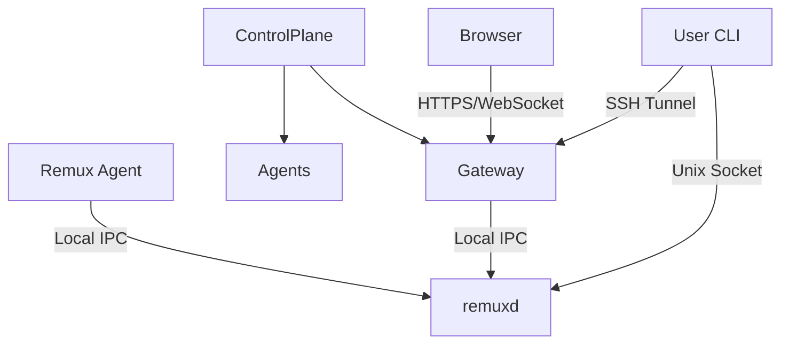
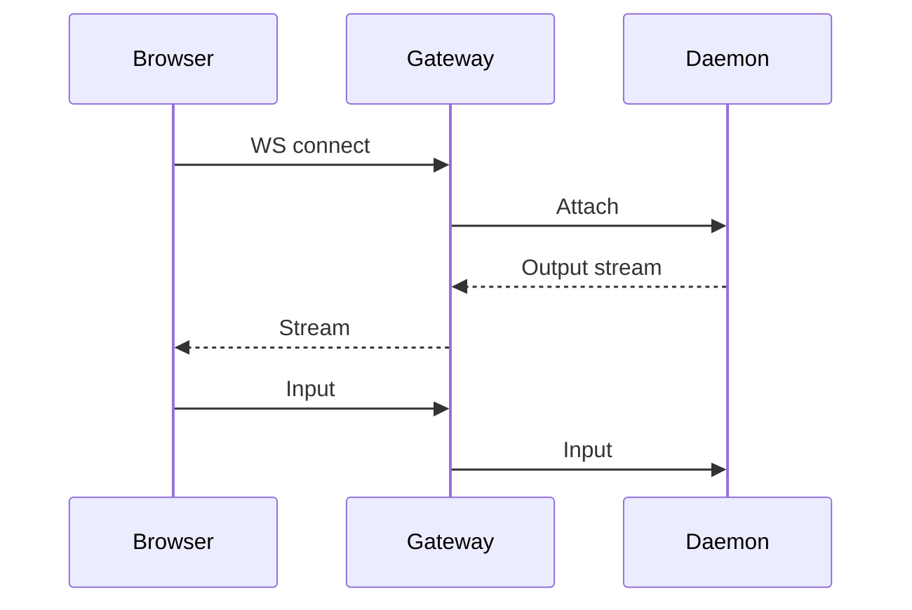

# Remux — Super PRD (Product Requirements Document)

## 1. Executive Summary

Remux is a modern, Rust-based terminal session runtime designed to replace legacy tools like tmux by rethinking the problem from first principles.

Instead of terminal multiplexing, Remux focuses on **durable execution contexts**:

* Sessions persist independently of clients
* Users and AI agents can reconnect at any time
* Terminal state is preserved coherently
* Remote access is native, not layered hacks (SSH + tmux)

Remux evolves across phases into:

1. Local session runtime
2. Remote access layer (SSH + gateway)
3. Web-native terminal platform
4. Fleet orchestration system for humans and AI agents

---

## 2. Problem Statement

### Current workflow (broken)

Typical modern workflow:

* SSH into machine
* Start shell
* Start tmux
* Attach session
* Repeat across systems

Problems:

* Redundant layers (SSH + shell + tmux)
* Poor UX and discoverability
* No structured API for automation
* No native support for AI agents
* Weak session introspection
* No centralized visibility across systems

### Root issue

Terminal persistence is treated as a UI problem instead of a **runtime problem**.

---

## 3. Vision

Remux becomes a **terminal session OS**:

* Persistent sessions are first-class
* Access is location-independent
* Humans and agents share the same runtime model
* Sessions are discoverable, inspectable, and controllable

---

## 4. Core Principles

1. **Local-first reliability**
2. **Daemon owns execution, not clients**
3. **Separation of concerns (runtime vs network vs control plane)**
4. **Protocol-first design**
5. **Machine-readable + human-friendly UX**
6. **Security is layered, not implicit**

---

## 5. System Architecture Overview

### Components

* remuxd (local daemon)
* remux CLI
* remux-gateway (network layer)
* remux-web (browser UI)
* remux-control-plane (fleet orchestration)

### Component Diagram



---

## 6. Phase Breakdown

### Phase 1 — Local Runtime (MVP)

Deliverables:

* PTY-backed session daemon
* Attach/detach
* Scrollback
* CLI

Success Criteria:

* Replace tmux locally

---

### Phase 2 — SSH Transport

Goal:
Remove manual SSH + tmux workflow

Design:

* Client uses SSH internally
* Opens channel to remote remuxd
* Bridges protocol

Example:

```bash
remux connect devbox
remux attach devbox:backend
```

---

### Phase 3 — Gateway (Web + API)

Add:

* HTTPS server
* WebSocket terminal streaming
* REST/gRPC control plane

---

### Phase 4 — Fleet Control Plane

Add:

* Host registry
* RBAC
* Session discovery
* AI agent integration

---

## 7. SSH Transport Design

### Goals

* No exposed ports required
* Works in enterprise environments
* Seamless user experience

### Flow

```text
Client -> SSH -> Remote host
  -> start remux bridge process
  -> forward Unix socket protocol
```

### Example Implementation (Rust pseudocode)

```rust
let ssh = SshSession::connect(host);
let channel = ssh.open_channel("remuxd");
client.bridge(channel);
```

---

## 8. Gateway API

### Protocol

* REST (control)
* WebSocket (interactive terminal)

### Example Endpoints

```
GET /sessions
POST /sessions
GET /sessions/{id}
POST /sessions/{id}/attach
POST /sessions/{id}/input
```

### WebSocket

```
ws://gateway/sessions/{id}/stream
```

Messages:

```json
{ "type": "output", "data": "..." }
{ "type": "input", "data": "..." }
```

---

## 9. Web Terminal Architecture

### Stack

Frontend:

* Next.js
* xterm.js
* WebSocket client

Backend:

* remux-gateway

### Flow



---

## 10. Fleet / Agent Model

### Goals

* Manage many hosts
* Enable AI-driven workflows

### Concepts

* Host
* Session
* Workspace
* Agent

### Example

```bash
remux open --project api --env dev
```

Control plane:

* selects host
* attaches or creates session

---

## 11. Security Model

### Layers

#### Local

* Unix socket permissions

#### SSH

* key-based auth

#### Gateway

* TLS
* JWT / OIDC

#### Fleet

* RBAC
* audit logs

### mTLS Example

```text
Client <-> Gateway
cert validation
```

---

## 12. Tech Stack

### Core

* Rust
* tokio
* portable-pty
* nix

### CLI

* clap

### Protocol

* serde

### TUI

* ratatui

### Web

* Next.js
* xterm.js

### Gateway

* axum or tonic

---

## 13. Example CLI UX

```bash
remux new backend
remux ls
remux attach backend
remux connect devbox
remux attach devbox:backend
```

---

## 14. Example Agent API

```json
{
  "action": "create_session",
  "name": "build"
}
```

---

## 15. Tasks Breakdown

### Core

* PTY management
* session registry
* IPC protocol

### CLI

* commands
* attach loop

### Gateway

* HTTP server
* WebSocket streaming

### Web

* terminal UI

### Control Plane

* host registry
* routing

---

## 16. Risks

* Terminal emulation complexity
* Multi-client sync issues
* Security misconfiguration

---

## 17. Success Metrics

* Replace tmux usage
* Reduce SSH friction
* Enable agent workflows

---

## 18. Future

* Full remote-first dev environments
* AI-native terminal runtime

---

## 19. Conclusion

Remux is not a tool. It is a new abstraction layer for terminal-based computing.

It replaces:

* tmux
* parts of SSH workflows
* ad-hoc remote dev patterns

And enables:

* persistent sessions
* remote access
* fleet orchestration
* AI-driven development

You: 

Tmux sucks. Old and hard to use. Let’s build it better at least the core where you can reconnect and your session is still going

ChatGPT: 

We can build a narrower, better version by not cloning all of tmux. The core value is just: durable processes, resumable sessions, multiple clients, and sane UX.

Thought for 6s

Yes. The mistake would be trying to “replace tmux” feature-for-feature.

The correct target is a **durable terminal runtime** with a modern client on top.

## What the core actually needs to do

At minimum:

1.  Start a command or shell in a PTY.
    
2.  Keep it alive after the UI disconnects.
    
3.  Let another client reconnect later.
    
4.  Preserve scrollback and terminal state well enough to resume naturally.
    
5.  Support multiple named sessions.
    
6.  Handle resize events and multiple viewers cleanly.
    
7.  Survive app crashes better than the client.
    

That is the real product.

tmux mixes together:

-   process/session durability
    
-   multiplexing
    
-   layout/window management
    
-   keyboard UX
    
-   scripting language
    
-   legacy terminal assumptions
    

You do not need all of that to win.

## The better architecture

Split it into two pieces:

### 1\. Background session daemon

A per-user daemon that owns sessions.

Responsibilities:

-   launch shells/commands inside PTYs
    
-   maintain session registry
    
-   capture output stream
    
-   store scrollback ring buffer
    
-   track live terminal dimensions
    
-   allow attach/detach
    
-   expose control API over local Unix socket
    
-   optionally persist metadata to disk
    

Think:

-   `aishd` or `persistd`
    
-   always running or socket-activated
    
-   one daemon per user
    

### 2\. Thin client

A clean CLI/TUI that attaches to sessions.

Responsibilities:

-   list sessions
    
-   create session
    
-   attach/detach
    
-   show previews
    
-   search scrollback
    
-   send input
    
-   maybe split-screen later
    

This is where tmux is terrible. Your client should be simple:

-   `term new api`
    
-   `term ls`
    
-   `term attach api`
    
-   `term kill api`
    
-   `term logs api`
    
-   `term share api`
    

Not prefix-key hell.

---

## First-principles model

A “session” is just:

-   a PTY pair
    
-   one foreground process tree
    
-   a byte stream of terminal output
    
-   a stream of keyboard input
    
-   terminal size state
    
-   environment/working directory metadata
    
-   lifecycle state
    

That means the main abstraction is not “pane” or “window.”

It is:

```
Session  
  id  
  name  
  created\_at  
  cwd  
  env  
  pty\_master  
  process\_group\_id  
  active\_clients\[\]  
  output\_buffer  
  terminal\_state  
  status
```

## How reconnection should work

When the client disconnects:

-   the daemon does nothing to the process
    
-   the shell/process continues running in the PTY
    
-   output is appended to the session buffer
    
-   on reconnect, client receives:
    
    -   recent scrollback
        
    -   current terminal state snapshot if available
        
    -   live stream from that point onward
        

This is the whole point.

## Hard part: terminal state

This is where many “better tmux” ideas get ugly.

A terminal is not just text. It is:

-   cursor position
    
-   colors/styles
    
-   alternate screen
    
-   mouse mode
    
-   bracketed paste
    
-   ANSI escape side effects
    

If you only store raw output bytes, reconnect can be imperfect. So you want a **virtual terminal emulator** in the daemon.

Best model:

-   daemon feeds PTY output into a terminal parser/emulator
    
-   maintain in-memory screen model
    
-   keep scrollback separately
    
-   new clients can render a coherent current state instead of replaying infinite bytes
    

Good libraries exist for this idea:

-   Rust: `alacritty_terminal`, `vt100`, `portable-pty`
    
-   Go: `creack/pty` + vt parser libs, though Rust is cleaner here
    
-   Node is possible but weaker for daemon/PTTY correctness
    

## Best implementation language

Use **Rust**.

Why:

-   PTY/process/signal handling matters
    
-   you want low-level control without C pain
    
-   long-running daemon should be robust
    
-   good fit for terminal parsing and async sockets
    

Go is acceptable for faster MVP, but Rust is the better long-term base for something terminal-heavy and correctness-sensitive.

## Suggested MVP stack

### Daemon

-   Rust
    
-   Unix domain socket for local API
    
-   `tokio` for async runtime
    
-   `portable-pty` or direct PTY handling
    
-   `serde` + `bincode`/JSON for messages
    
-   `alacritty_terminal` or `vt100` for terminal state model
    
-   local file persistence under:
    
    -   `~/.local/share/yourtool/`
        
    -   `~/.config/yourtool/`
        
    -   `~/.cache/yourtool/`
        

### Client

Two options:

#### Option A: CLI first

Simple CLI with attach in raw terminal mode.  
Fastest path.

#### Option B: modern TUI

Use:

-   Rust + `ratatui` / `crossterm`
    

Then later maybe a GUI:

-   Tauri desktop app
    
-   web client over websocket for remote access
    

## Session lifecycle

### Create

`term new --name api`

Daemon:

-   open PTY
    
-   spawn login shell or command
    
-   register session
    
-   attach client
    

### Detach

Client exits raw mode and disconnects.  
Daemon keeps process alive.

### Reattach

`term attach api`

Daemon:

-   sends initial screen snapshot + scrollback window
    
-   streams live updates
    
-   accepts input events
    

### Exit

When shell/process exits:

-   daemon marks session as exited
    
-   keeps logs/history until cleanup policy removes it
    

## API shape

Use a simple local protocol over Unix socket.

Commands:

-   `CreateSession`
    
-   `ListSessions`
    
-   `AttachSession`
    
-   `DetachSession`
    
-   `ResizeSession`
    
-   `SendInput`
    
-   `GetScrollback`
    
-   `KillSession`
    
-   `RenameSession`
    
-   `SubscribeEvents`
    

Event stream:

-   stdout/pty output delta
    
-   status changes
    
-   resize notices
    
-   process exit
    
-   bell/activity markers
    

## UX ideas that beat tmux immediately

### Better defaults

No prefix key required for core operations.

### Preview before attach

`term ls` shows:

-   session name
    
-   current command
    
-   idle time
    
-   exit state
    
-   last few lines
    

### Human naming

Auto-name sessions from cwd or command:

-   `infra-prod`
    
-   `backend-tests`
    
-   `postgres-migration`
    

### Built-in search

`term search api "error"`

### Session restore hints

Show:

-   cwd
    
-   host
    
-   git branch
    
-   command
    
-   started by
    

### Safe detach/reattach

Clear messaging:

-   attached
    
-   detached
    
-   session still running
    

tmux fails mostly in discoverability.

## What not to build in v1

Do not start with:

-   panes
    
-   windows
    
-   scripting DSL
    
-   status bar customization
    
-   remote collaboration
    
-   plugin system
    
-   nested layout engine
    
-   copy-mode complexity
    

Those are feature traps.

## Smart v1 feature set

Build this:

-   named sessions
    
-   create/list/attach/detach/kill
    
-   persistent scrollback
    
-   resize handling
    
-   multiple observers
    
-   simple session metadata
    
-   clean CLI
    
-   optional JSON output for automation
    
-   local-only security model
    

That alone is useful.

## Security model

For local-first:

-   daemon binds to per-user Unix socket
    
-   socket permissions restrict access to same user
    
-   no TCP by default
    
-   session files live in user-owned data dir
    

For remote later:

-   separate gateway service
    
-   SSH or mTLS
    
-   do not bolt insecure remote mode into the daemon
    

## How it differs from tmux conceptually

tmux says:

-   terminal multiplexing is the product
    

Your replacement should say:

-   **persistent execution contexts are the product**
    
-   multiplexing is optional
    

That reframing is important.

## Concrete product shape

Name idea:

-   `reterm`
    
-   `anchor`
    
-   `hold`
    
-   `stay`
    
-   `loom`
    
-   `sessiond`
    

CLI example:

```
Bash

session new \--name backend  
session ls  
session attach backend  
session detach  
session logs backend  
session kill backend
```

JSON automation:

```
Bash

session ls \--json  
session inspect backend \--json
```

## Technical edge cases you must handle

These are the real engineering problems:

### 1\. PTY ownership

The daemon owns the PTY master. Clients never directly own the process.

### 2\. Resizing

If two clients attach with different sizes, choose one policy:

-   active controller owns size
    
-   observers are read-only
    
-   or maintain per-client reflow in the renderer
    

Simplest: one interactive client, many observers.

### 3\. Alt-screen apps

Programs like `vim`, `less`, TUIs, and full-screen apps use alternate screen buffers. Your terminal model must support this or reconnect feels broken.

### 4\. Flow control and backpressure

Slow client must not stall the session. Keep bounded queues and drop/rebuild from state when needed.

### 5\. Exit detection

Track child process tree and session exit cleanly.

### 6\. Crash recovery

If daemon crashes, you probably lose active PTYs unless you do much more advanced work. So design for:

-   daemon robustness first
    
-   optional supervised service via `systemd --user` or launchd
    

## Best deployment model

### Linux

Run as `systemd --user` service with socket activation.

### macOS

Run under `launchd` per user.

That gives:

-   auto-start
    
-   restart on crash
    
-   better background persistence
    

## Roadmap

### v1

-   daemon
    
-   local socket API
    
-   single-session attach
    
-   scrollback
    
-   named sessions
    
-   clean CLI
    

### v2

-   multiple observers
    
-   previews
    
-   search
    
-   better metadata
    
-   session export/import
    

### v3

-   panes/splits
    
-   remote web/desktop UI
    
-   team sharing
    
-   API tokens and RBAC
    

### v4

-   durable job/workspace system
    
-   session templates
    
-   dev environment orchestration
    

## Why this can actually win

Because most users do not love tmux. They tolerate it.

They want:

-   “my shell keeps running”
    
-   “I can come back later”
    
-   “I can find my work”
    
-   “it doesn’t feel like software from 2007”
    

That is a solvable problem.

## My blunt recommendation

Build **not-tmux**, specifically:

-   Rust daemon
    
-   PTY-backed persistent sessions
    
-   local Unix socket API
    
-   terminal-state emulator in daemon
    
-   simple ergonomic CLI client
    
-   no panes in v1
    

That gives a product people will actually use.

If you want, I’ll turn this into a full PRD/TRD with:

-   architecture diagram
    
-   Rust crate choices
    
-   socket protocol
    
-   data model
    
-   MVP task breakdown
    
-   exact repo structure

You: 

Remux is the name build it in rust

ChatGPT: 

I’m turning this into a concrete Rust project shape rather than hand-waving. I’ll define the core daemon/client split, crate layout, protocol, and the exact MVP boundaries so the implementation can start cleanly.

Thought for 8s

Remux-rust-mvp

Copy

Edit

Download

# Remux

A modern Rust-built terminal session runtime focused on durable PTY-backed sessions, disconnect/reconnect, clean UX, and a local-first architecture.

## Product goal

Remux is **not** a tmux clone.

Remux is a persistent terminal runtime with a modern client.

Core promise:

-   start a shell or command
    
-   disconnect at any time
    
-   reconnect later
    
-   session is still running
    
-   terminal state is coherent on reattach
    
-   session management is simple and scriptable
    

## Non-goals for v1

Do not build these in the initial version:

-   panes and tiling layout engine
    
-   tmux-compatible scripting
    
-   plugin framework
    
-   status bar customization system
    
-   remote multi-user collaboration
    
-   TCP listener by default
    
-   window manager abstraction
    

## Core architecture

Remux consists of two binaries:

### 1\. `remuxd`

Per-user background daemon.

Responsibilities:

-   create and manage PTY-backed sessions
    
-   spawn shells or commands
    
-   keep processes alive after client disconnect
    
-   maintain session metadata
    
-   maintain scrollback ring buffer
    
-   maintain virtual terminal state for correct reattach
    
-   expose local control API over Unix domain socket
    
-   persist session metadata and history policy to disk
    

### 2\. `remux`

Thin client CLI/TUI.

Responsibilities:

-   create/list/attach/detach/kill sessions
    
-   render terminal state returned by daemon
    
-   forward input to daemon while attached
    
-   show session previews and metadata
    
-   support JSON output for scripting
    

## First-principles data model

A session is:

-   a PTY master
    
-   a process tree running under that PTY
    
-   a stream of input bytes
    
-   a stream of output bytes
    
-   a virtual terminal state model
    
-   a scrollback buffer
    
-   lifecycle metadata
    

### Session model

pub struct SessionId(pub uuid::Uuid);

  

pub struct SessionMeta {

pub id: SessionId,

pub name: String,

pub cwd: std::path::PathBuf,

pub command: Vec<String\>,

pub created\_at: chrono::DateTime<chrono::Utc\>,

pub updated\_at: chrono::DateTime<chrono::Utc\>,

pub status: SessionStatus,

pub last\_exit\_code: Option<i32\>,

pub controlling\_client: Option<ClientId\>,

pub attached\_clients: Vec<ClientId\>,

pub last\_size: TermSize,

}

  

pub enum SessionStatus {

Starting,

Running,

Exited,

Failed,

}

  

pub struct TermSize {

pub cols: u16,

pub rows: u16,

}

### Runtime state

pub struct SessionRuntime {

pub meta: SessionMeta,

pub scrollback: ScrollbackBuffer,

pub vt\_state: VirtualTerminalState,

pub process: ProcessHandle,

pub pty: PtyHandle,

}

## Client/daemon boundary

The daemon owns the PTY and child process.

Clients never directly talk to the process.

This is required for durability and consistent reattachment.

## IPC protocol

Use a Unix domain socket with a framed message protocol.

Recommended encoding:

-   request/response control plane: `serde` + `rmp-serde` or `bincode`
    
-   streaming events: framed binary messages
    

Alternative for debugging:

-   newline-delimited JSON in dev mode
    

### Request types

pub enum Request {

Ping,

ListSessions,

CreateSession(CreateSessionRequest),

InspectSession { session: SessionSelector },

AttachSession { session: SessionSelector, size: TermSize, mode: AttachMode },

DetachSession { session: SessionSelector },

ResizeSession { session: SessionSelector, size: TermSize },

SendInput { session: SessionSelector, data: Vec<u8\> },

ReadScrollback { session: SessionSelector, lines: usize },

RenameSession { session: SessionSelector, new\_name: String },

KillSession { session: SessionSelector, signal: Option<i32\> },

SubscribeSessionEvents { session: SessionSelector },

}

### Response types

pub enum Response {

Pong,

Ok,

Error(RemuxError),

SessionList(Vec<SessionSummary\>),

SessionDetails(SessionDetails),

Created(SessionDetails),

Attached(AttachBootstrap),

Scrollback(ScrollbackChunk),

}

### Event stream

pub enum Event {

Output { session: SessionId, data: Vec<u8\> },

StateSnapshot { session: SessionId, snapshot: TerminalSnapshot },

SessionUpdated(SessionSummary),

SessionExited { session: SessionId, exit\_code: Option<i32\> },

Error(RemuxError),

}

## Reattach model

On attach:

1.  client sends requested terminal size
    
2.  daemon marks client as controlling or observer
    
3.  daemon returns bootstrap payload containing:
    
    -   session metadata
        
    -   recent scrollback
        
    -   current terminal snapshot
        
4.  daemon begins streaming live output events
    
5.  client enters raw mode and forwards keyboard input
    

The correct behavior is not “replay everything from the beginning.”

The daemon should maintain a virtual terminal model so the attach operation can start from a coherent current state.

## Terminal state handling

This is the hardest technical area.

A terminal is not just lines of text. It includes:

-   cursor position
    
-   alternate screen buffer
    
-   text attributes/colors
    
-   mouse mode
    
-   bracketed paste mode
    
-   title changes
    
-   ANSI escape side effects
    

### Recommendation

Use a virtual terminal emulator/state model inside `remuxd`.

Possible libraries to evaluate:

-   `alacritty_terminal`
    
-   `vt100`
    

Preferred direction:

-   start with `vt100` for lower-complexity snapshotting if sufficient
    
-   evaluate `alacritty_terminal` if broader terminal behavior support is needed
    

## Process and PTY handling

Recommended crates:

-   `portable-pty` for PTY abstraction
    
-   `tokio` for async I/O and socket handling
    
-   `nix` for Unix-specific process and signal handling where required
    

Requirements:

-   shell or command is spawned under the PTY slave
    
-   daemon retains PTY master
    
-   child process remains alive when clients disconnect
    
-   process exit is detected and session status updated
    
-   kill and signal forwarding supported
    

## Attachment policy

Use the following v1 rule:

-   exactly one controlling client at a time
    
-   zero or more observer clients allowed later if desired
    
-   only controlling client can resize or send input
    

This avoids conflicting resize and keyboard ownership semantics.

## Resize policy

The controlling client owns terminal size.

When the controlling client resizes:

-   daemon updates PTY size
    
-   daemon updates virtual terminal model metadata
    
-   observers, if supported later, receive whatever rendering results from that canonical size
    

## Persistence model

Persist only what is useful and safe in v1.

### Persist to disk

-   session metadata
    
-   command/cwd/env subset
    
-   timestamps
    
-   recent scrollback if policy enables it
    
-   exited session records until cleanup
    

### Do not try to persist

-   full live PTY state across daemon restart
    
-   seamless recovery after daemon crash
    

That problem is much harder and should not be promised in v1.

## Failure semantics

Be explicit.

### Supported in v1

-   session survives client disconnect
    
-   session survives client crash
    
-   session survives normal shell detach/reattach cycles
    
-   daemon can be supervised and restarted automatically by system service manager
    

### Not guaranteed in v1

-   session survives daemon crash or daemon upgrade while attached
    
-   session survives host reboot unless paired with shell/job restoration logic
    

## Service management

### Linux

Support user-level `systemd --user` unit and optional socket activation.

### macOS

Support per-user `launchd` service.

## CLI UX

### Commands

remux new \--name backend

remux new \--name infra \-- /bin/bash

remux ls

remux attach backend

remux detach

remux inspect backend

remux logs backend

remux rename backend api-backend

remux kill backend

remux ls \--json

### UX principles

-   no prefix key model for core management
    
-   human-readable defaults
    
-   names inferred from cwd or command if omitted
    
-   previews in `ls`
    
-   scriptable JSON output
    

## Proposed v1 `ls` output

NAME STATUS PID CREATED CWD CMD

backend run 4821 3h ago ~/src/backend bash

infra run 4991 22m ago ~/src/infra just dev

db-migrate exit:0 - 4h ago ~/src/backend alembic upgrade head

Optional preview mode:

remux ls \--preview

This should show last few lines of scrollback for each running session.

## Suggested workspace layout

remux/

Cargo.toml

Cargo.lock

crates/

remux-core/

src/

lib.rs

protocol.rs

session.rs

error.rs

terminal.rs

config.rs

remux-daemon/

src/

main.rs

daemon.rs

ipc.rs

session\_manager.rs

pty.rs

process.rs

persistence.rs

attach.rs

remux-cli/

src/

main.rs

cmd/

new.rs

ls.rs

attach.rs

inspect.rs

logs.rs

rename.rs

kill.rs

client.rs

render.rs

raw\_mode.rs

## Crate responsibilities

### `remux-core`

Shared types and logic:

-   protocol messages
    
-   error types
    
-   config loading
    
-   common models
    
-   session selectors
    
-   terminal snapshot types
    

### `remux-daemon`

Runtime and session engine:

-   socket server
    
-   session registry
    
-   PTY/process lifecycle
    
-   scrollback and virtual terminal updates
    
-   persistence
    
-   event fanout
    

### `remux-cli`

Primary user interface:

-   argument parsing with `clap`
    
-   raw terminal attach mode
    
-   list/inspect/logs commands
    
-   JSON output mode
    

### `remux-tui`

Optional richer manager UI after CLI is stable.

### `remux-testkit`

Integration helpers:

-   daemon harness
    
-   PTY test utilities
    
-   fake clients for attach/detach/resize tests
    

## Configuration

Example config path:

-   `~/.config/remux/config.toml`
    

Example config:

\[data\]

dir = "~/.local/share/remux"

  

\[daemon\]

socket\_path = "~/.local/state/remux/remuxd.sock"

max\_scrollback\_lines = 20000

persist\_scrollback = true

cleanup\_exited\_after\_hours = 168

  

\[client\]

default\_attach\_mode = "control"

default\_shell = "/bin/bash"

## Session naming strategy

When `--name` is omitted:

1.  use basename of cwd
    
2.  if collision, append numeric suffix
    
3.  optionally infer from primary command
    

Examples:

-   `~/src/backend` -> `backend`
    
-   `~/infra/prod` -> `prod`
    
-   `cargo test` in repo `api` -> `api-test`
    

## Observability

Add structured logging from day one.

Recommended crates:

-   `tracing`
    
-   `tracing-subscriber`
    

Log categories:

-   daemon startup/shutdown
    
-   session create/attach/detach/exit
    
-   PTY spawn errors
    
-   IPC errors
    
-   resize/input control events
    

## Testing strategy

### Unit tests

-   session registry behavior
    
-   naming collision logic
    
-   protocol serialization
    
-   config parsing
    
-   cleanup policy
    

### Integration tests

-   create session, detach, reattach, process still alive
    
-   command continues running after client disconnect
    
-   resize propagates correctly
    
-   exited session visible in listing
    
-   scrollback available after reattach
    
-   alt-screen app smoke test using `vim` or `less`
    

### Manual test matrix

-   bash
    
-   zsh
    
-   fish
    
-   vim
    
-   htop
    
-   less
    
-   cargo watch
    
-   long-running logs/tail
    

## MVP milestone breakdown

### Milestone 0: repository bootstrap

-   cargo workspace
    
-   core models and errors
    
-   clap CLI skeleton
    
-   daemon entrypoint
    
-   tracing/logging baseline
    

### Milestone 1: local daemon + session lifecycle

-   Unix socket server
    
-   create/list/kill sessions
    
-   spawn PTY-backed shell or command
    
-   track status and exit
    

### Milestone 2: attach/detach core loop

-   raw terminal mode in client
    
-   input forwarding
    
-   output streaming
    
-   detach without killing child process
    

### Milestone 3: scrollback and state bootstrap

-   scrollback ring buffer
    
-   attach bootstrap payload
    
-   session previews/logs
    

### Milestone 4: virtual terminal snapshotting

-   coherent reattach for full-screen apps
    
-   cursor/style/alt-screen handling at acceptable baseline
    

### Milestone 5: packaging and polish

-   systemd user service
    
-   launchd plist
    
-   config file support
    
-   JSON output
    
-   better error messaging
    

## Near-term roadmap after MVP

### v1.1

-   observer clients
    
-   `remux ls --preview`
    
-   session search/filter
    
-   better inspect metadata
    

### v1.2

-   lightweight TUI manager
    
-   copy/search mode
    
-   export session transcript
    

### v1.3

-   split panes if still justified
    
-   remote access via separate gateway process
    
-   auth and mTLS for remote mode
    

## Technical risks

### 1\. Terminal emulation complexity

Reattach quality depends on terminal model correctness.

### 2\. Full-screen/TUI compatibility

`vim`, `htop`, and similar tools will expose terminal handling bugs quickly.

### 3\. Backpressure

Slow clients cannot be allowed to block session output processing.

### 4\. Daemon crash expectations

Need precise product messaging about what “persistent” means.

## Product positioning

Remux is not “tmux but rewritten.”

Remux is:

-   durable shell sessions
    
-   cleaner UX
    
-   better defaults
    
-   modern inspectability
    
-   scriptable local API
    

## Recommended first implementation choices

Use:

-   Rust stable
    
-   `tokio`
    
-   `clap`
    
-   `serde`
    
-   `uuid`
    
-   `chrono`
    
-   `tracing`
    
-   `portable-pty`
    
-   `nix`
    
-   `vt100` first, re-evaluate later
    

## Exact v1 definition

A release is v1-ready when all of the following are true:

-   `remux new` creates a named session
    
-   `remux attach` attaches to a running session
    
-   detaching does not kill the shell or command
    
-   reattaching later shows a coherent current terminal state
    
-   `remux ls` reliably shows active and exited sessions
    
-   `remux kill` terminates target session cleanly
    
-   scrollback is retained across detach/reattach
    
-   works on Linux and macOS for common shells and terminal apps
    

## Recommended next artifact

After this spec, the next practical deliverable should be:

1.  workspace scaffold
    
2.  protocol definitions
    
3.  daemon session manager skeleton
    
4.  CLI command skeleton
    
5.  first integration test: create -> detach -> reattach
    

Good. **Remux** is a better name.

I laid out the Rust MVP architecture and implementation plan in the canvas: daemon/client split, session model, IPC protocol, crate layout, config, testing, and milestone breakdown.

The correct build target is:

-   `remuxd` = per-user daemon that owns PTYs and sessions
    
-   `remux` = client CLI that attaches/detaches/lists/kills
    
-   local Unix socket IPC
    
-   PTY-backed sessions
    
-   scrollback retention
    
-   virtual terminal state for coherent reattach
    
-   no panes in v1
    

The repo shape should be:

-   `remux-core`
    
-   `remux-daemon`
    
-   `remux-cli`
    
-   `remux-testkit`
    
-   optional `remux-tui` later
    

Best v1 stack:

-   Rust stable
    
-   `tokio`
    
-   `clap`
    
-   `serde`
    
-   `tracing`
    
-   `portable-pty`
    
-   `nix`
    
-   `vt100` first
    

Critical product boundary:

-   survive **client disconnect**
    
-   survive **client crash**
    
-   do **not** promise seamless recovery from daemon crash in v1
    

The next correct move is to generate the actual Rust workspace scaffold with:

-   `Cargo.toml` workspace
    
-   shared protocol types
    
-   daemon main loop
    
-   CLI commands
    
-   first integration test for create → detach → reattach
    

I can write that scaffold next.

You: 

# Remux

A modern Rust-built terminal session runtime focused on durable PTY-backed sessions, disconnect/reconnect, clean UX, and a local-first architecture.

## Product goal

Remux is **not** a tmux clone.

Remux is a persistent terminal runtime with a modern client.

Core promise:

-   start a shell or command
    
-   disconnect at any time
    
-   reconnect later
    
-   session is still running
    
-   terminal state is coherent on reattach
    
-   session management is simple and scriptable
    

## Non-goals for v1

Do not build these in the initial version:

-   panes and tiling layout engine
    
-   tmux-compatible scripting
    
-   plugin framework
    
-   status bar customization system
    
-   remote multi-user collaboration
    
-   TCP listener by default
    
-   window manager abstraction
    

## Core architecture

Remux consists of two binaries:

### 1\. `remuxd`

Per-user background daemon.

Responsibilities:

-   create and manage PTY-backed sessions
    
-   spawn shells or commands
    
-   keep processes alive after client disconnect
    
-   maintain session metadata
    
-   maintain scrollback ring buffer
    
-   maintain virtual terminal state for correct reattach
    
-   expose local control API over Unix domain socket
    
-   persist session metadata and history policy to disk
    

### 2\. `remux`

Thin client CLI/TUI.

Responsibilities:

-   create/list/attach/detach/kill sessions
    
-   render terminal state returned by daemon
    
-   forward input to daemon while attached
    
-   show session previews and metadata
    
-   support JSON output for scripting
    

## First-principles data model

A session is:

-   a PTY master
    
-   a process tree running under that PTY
    
-   a stream of input bytes
    
-   a stream of output bytes
    
-   a virtual terminal state model
    
-   a scrollback buffer
    
-   lifecycle metadata
    

### Session model

pub struct SessionId(pub uuid::Uuid);

  

pub struct SessionMeta {

pub id: SessionId,

pub name: String,

pub cwd: std::path::PathBuf,

pub command: Vec<String\>,

pub created\_at: chrono::DateTime<chrono::Utc\>,

pub updated\_at: chrono::DateTime<chrono::Utc\>,

pub status: SessionStatus,

pub last\_exit\_code: Option<i32\>,

pub controlling\_client: Option<ClientId\>,

pub attached\_clients: Vec<ClientId\>,

pub last\_size: TermSize,

}

  

pub enum SessionStatus {

Starting,

Running,

Exited,

Failed,

}

  

pub struct TermSize {

pub cols: u16,

pub rows: u16,

}

### Runtime state

pub struct SessionRuntime {

pub meta: SessionMeta,

pub scrollback: ScrollbackBuffer,

pub vt\_state: VirtualTerminalState,

pub process: ProcessHandle,

pub pty: PtyHandle,

}

## Client/daemon boundary

The daemon owns the PTY and child process.

Clients never directly talk to the process.

This is required for durability and consistent reattachment.

## IPC protocol

Use a Unix domain socket with a framed message protocol.

Recommended encoding:

-   request/response control plane: `serde` + `rmp-serde` or `bincode`
    
-   streaming events: framed binary messages
    

Alternative for debugging:

-   newline-delimited JSON in dev mode
    

### Request types

pub enum Request {

Ping,

ListSessions,

CreateSession(CreateSessionRequest),

InspectSession { session: SessionSelector },

AttachSession { session: SessionSelector, size: TermSize, mode: AttachMode },

DetachSession { session: SessionSelector },

ResizeSession { session: SessionSelector, size: TermSize },

SendInput { session: SessionSelector, data: Vec<u8\> },

ReadScrollback { session: SessionSelector, lines: usize },

RenameSession { session: SessionSelector, new\_name: String },

KillSession { session: SessionSelector, signal: Option<i32\> },

SubscribeSessionEvents { session: SessionSelector },

}

### Response types

pub enum Response {

Pong,

Ok,

Error(RemuxError),

SessionList(Vec<SessionSummary\>),

SessionDetails(SessionDetails),

Created(SessionDetails),

Attached(AttachBootstrap),

Scrollback(ScrollbackChunk),

}

### Event stream

pub enum Event {

Output { session: SessionId, data: Vec<u8\> },

StateSnapshot { session: SessionId, snapshot: TerminalSnapshot },

SessionUpdated(SessionSummary),

SessionExited { session: SessionId, exit\_code: Option<i32\> },

Error(RemuxError),

}

## Reattach model

On attach:

1.  client sends requested terminal size
    
2.  daemon marks client as controlling or observer
    
3.  daemon returns bootstrap payload containing:
    
    -   session metadata
        
    -   recent scrollback
        
    -   current terminal snapshot
        
4.  daemon begins streaming live output events
    
5.  client enters raw mode and forwards keyboard input
    

The correct behavior is not “replay everything from the beginning.”

The daemon should maintain a virtual terminal model so the attach operation can start from a coherent current state.

## Terminal state handling

This is the hardest technical area.

A terminal is not just lines of text. It includes:

-   cursor position
    
-   alternate screen buffer
    
-   text attributes/colors
    
-   mouse mode
    
-   bracketed paste mode
    
-   title changes
    
-   ANSI escape side effects
    

### Recommendation

Use a virtual terminal emulator/state model inside `remuxd`.

Possible libraries to evaluate:

-   `alacritty_terminal`
    
-   `vt100`
    

Preferred direction:

-   start with `vt100` for lower-complexity snapshotting if sufficient
    
-   evaluate `alacritty_terminal` if broader terminal behavior support is needed
    

## Process and PTY handling

Recommended crates:

-   `portable-pty` for PTY abstraction
    
-   `tokio` for async I/O and socket handling
    
-   `nix` for Unix-specific process and signal handling where required
    

Requirements:

-   shell or command is spawned under the PTY slave
    
-   daemon retains PTY master
    
-   child process remains alive when clients disconnect
    
-   process exit is detected and session status updated
    
-   kill and signal forwarding supported
    

## Attachment policy

Use the following v1 rule:

-   exactly one controlling client at a time
    
-   zero or more observer clients allowed later if desired
    
-   only controlling client can resize or send input
    

This avoids conflicting resize and keyboard ownership semantics.

## Resize policy

The controlling client owns terminal size.

When the controlling client resizes:

-   daemon updates PTY size
    
-   daemon updates virtual terminal model metadata
    
-   observers, if supported later, receive whatever rendering results from that canonical size
    

## Persistence model

Persist only what is useful and safe in v1.

### Persist to disk

-   session metadata
    
-   command/cwd/env subset
    
-   timestamps
    
-   recent scrollback if policy enables it
    
-   exited session records until cleanup
    

### Do not try to persist

-   full live PTY state across daemon restart
    
-   seamless recovery after daemon crash
    

That problem is much harder and should not be promised in v1.

## Failure semantics

Be explicit.

### Supported in v1

-   session survives client disconnect
    
-   session survives client crash
    
-   session survives normal shell detach/reattach cycles
    
-   daemon can be supervised and restarted automatically by system service manager
    

### Not guaranteed in v1

-   session survives daemon crash or daemon upgrade while attached
    
-   session survives host reboot unless paired with shell/job restoration logic
    

## Service management

### Linux

Support user-level `systemd --user` unit and optional socket activation.

### macOS

Support per-user `launchd` service.

## CLI UX

### Commands

remux new \--name backend

remux new \--name infra \-- /bin/bash

remux ls

remux attach backend

remux detach

remux inspect backend

remux logs backend

remux rename backend api-backend

remux kill backend

remux ls \--json

### UX principles

-   no prefix key model for core management
    
-   human-readable defaults
    
-   names inferred from cwd or command if omitted
    
-   previews in `ls`
    
-   scriptable JSON output
    

## Proposed v1 `ls` output

NAME STATUS PID CREATED CWD CMD

backend run 4821 3h ago ~/src/backend bash

infra run 4991 22m ago ~/src/infra just dev

db-migrate exit:0 - 4h ago ~/src/backend alembic upgrade head

Optional preview mode:

remux ls \--preview

This should show last few lines of scrollback for each running session.

## Suggested workspace layout

remux/

Cargo.toml

Cargo.lock

crates/

remux-core/

src/

lib.rs

protocol.rs

session.rs

error.rs

terminal.rs

config.rs

remux-daemon/

src/

main.rs

daemon.rs

ipc.rs

session\_manager.rs

pty.rs

process.rs

persistence.rs

attach.rs

remux-cli/

src/

main.rs

cmd/

new.rs

ls.rs

attach.rs

inspect.rs

logs.rs

rename.rs

kill.rs

client.rs

render.rs

raw\_mode.rs

## Crate responsibilities

### `remux-core`

Shared types and logic:

-   protocol messages
    
-   error types
    
-   config loading
    
-   common models
    
-   session selectors
    
-   terminal snapshot types
    

### `remux-daemon`

Runtime and session engine:

-   socket server
    
-   session registry
    
-   PTY/process lifecycle
    
-   scrollback and virtual terminal updates
    
-   persistence
    
-   event fanout
    

### `remux-cli`

Primary user interface:

-   argument parsing with `clap`
    
-   raw terminal attach mode
    
-   list/inspect/logs commands
    
-   JSON output mode
    

### `remux-tui`

Optional richer manager UI after CLI is stable.

### `remux-testkit`

Integration helpers:

-   daemon harness
    
-   PTY test utilities
    
-   fake clients for attach/detach/resize tests
    

## Configuration

Example config path:

-   `~/.config/remux/config.toml`
    

Example config:

\[data\]

dir = "~/.local/share/remux"

  

\[daemon\]

socket\_path = "~/.local/state/remux/remuxd.sock"

max\_scrollback\_lines = 20000

persist\_scrollback = true

cleanup\_exited\_after\_hours = 168

  

\[client\]

default\_attach\_mode = "control"

default\_shell = "/bin/bash"

## Session naming strategy

When `--name` is omitted:

1.  use basename of cwd
    
2.  if collision, append numeric suffix
    
3.  optionally infer from primary command
    

Examples:

-   `~/src/backend` -> `backend`
    
-   `~/infra/prod` -> `prod`
    
-   `cargo test` in repo `api` -> `api-test`
    

## Observability

Add structured logging from day one.

Recommended crates:

-   `tracing`
    
-   `tracing-subscriber`
    

Log categories:

-   daemon startup/shutdown
    
-   session create/attach/detach/exit
    
-   PTY spawn errors
    
-   IPC errors
    
-   resize/input control events
    

## Testing strategy

### Unit tests

-   session registry behavior
    
-   naming collision logic
    
-   protocol serialization
    
-   config parsing
    
-   cleanup policy
    

### Integration tests

-   create session, detach, reattach, process still alive
    
-   command continues running after client disconnect
    
-   resize propagates correctly
    
-   exited session visible in listing
    
-   scrollback available after reattach
    
-   alt-screen app smoke test using `vim` or `less`
    

### Manual test matrix

-   bash
    
-   zsh
    
-   fish
    
-   vim
    
-   htop
    
-   less
    
-   cargo watch
    
-   long-running logs/tail
    

## MVP milestone breakdown

### Milestone 0: repository bootstrap

-   cargo workspace
    
-   core models and errors
    
-   clap CLI skeleton
    
-   daemon entrypoint
    
-   tracing/logging baseline
    

### Milestone 1: local daemon + session lifecycle

-   Unix socket server
    
-   create/list/kill sessions
    
-   spawn PTY-backed shell or command
    
-   track status and exit
    

### Milestone 2: attach/detach core loop

-   raw terminal mode in client
    
-   input forwarding
    
-   output streaming
    
-   detach without killing child process
    

### Milestone 3: scrollback and state bootstrap

-   scrollback ring buffer
    
-   attach bootstrap payload
    
-   session previews/logs
    

### Milestone 4: virtual terminal snapshotting

-   coherent reattach for full-screen apps
    
-   cursor/style/alt-screen handling at acceptable baseline
    

### Milestone 5: packaging and polish

-   systemd user service
    
-   launchd plist
    
-   config file support
    
-   JSON output
    
-   better error messaging
    

## Near-term roadmap after MVP

### v1.1

-   observer clients
    
-   `remux ls --preview`
    
-   session search/filter
    
-   better inspect metadata
    

### v1.2

-   lightweight TUI manager
    
-   copy/search mode
    
-   export session transcript
    

### v1.3

-   split panes if still justified
    
-   remote access via separate gateway process
    
-   auth and mTLS for remote mode
    

## Technical risks

### 1\. Terminal emulation complexity

Reattach quality depends on terminal model correctness.

### 2\. Full-screen/TUI compatibility

`vim`, `htop`, and similar tools will expose terminal handling bugs quickly.

### 3\. Backpressure

Slow clients cannot be allowed to block session output processing.

### 4\. Daemon crash expectations

Need precise product messaging about what “persistent” means.

## Product positioning

Remux is not “tmux but rewritten.”

Remux is:

-   durable shell sessions
    
-   cleaner UX
    
-   better defaults
    
-   modern inspectability
    
-   scriptable local API
    

## Recommended first implementation choices

Use:

-   Rust stable
    
-   `tokio`
    
-   `clap`
    
-   `serde`
    
-   `uuid`
    
-   `chrono`
    
-   `tracing`
    
-   `portable-pty`
    
-   `nix`
    
-   `vt100` first, re-evaluate later
    

## Exact v1 definition

A release is v1-ready when all of the following are true:

-   `remux new` creates a named session
    
-   `remux attach` attaches to a running session
    
-   detaching does not kill the shell or command
    
-   reattaching later shows a coherent current terminal state
    
-   `remux ls` reliably shows active and exited sessions
    
-   `remux kill` terminates target session cleanly
    
-   scrollback is retained across detach/reattach
    
-   works on Linux and macOS for common shells and terminal apps
    

## Recommended next artifact

After this spec, the next practical deliverable should be:

1.  workspace scaffold
    
2.  protocol definitions
    
3.  daemon session manager skeleton
    
4.  CLI command skeleton
    
5.  first integration test: create -> detach -> reattach

ChatGPT: 

yeah please. and make sure this is robust and enterprise grade replacement for the modern world that works better than tmux. make it intuitive and maybe a tui that can manage sessions easily as well.

You: 

Thought for 6m 59s

I created a Rust workspace scaffold for **Remux** with:

-   `remuxd` daemon skeleton
    
-   `remux` CLI skeleton
    
-   `remux-tui` manager shell
    
-   shared core crate for protocol/config/session models
    
-   docs, packaging stubs, CI stub, and test harness skeleton
    

Files:

-   Download the ZIP
    
-   Download the tar.gz
    

What is in it:

-   Correct daemon/client separation
    
-   Unix socket IPC framing
    
-   session/config/protocol models
    
-   CLI commands: `new`, `ls`, `inspect`, `attach`, `logs`, `rename`, `kill`
    
-   TUI placeholder with session-management layout
    
-   systemd and launchd starter files
    
-   roadmap and architecture docs
    

Important limitation:

-   This environment does not have `cargo` installed, so I could not compile or run tests here.
    
-   The scaffold is structurally sound, but the PTY runtime and live attach streaming are still placeholders, not a finished tmux replacement yet.
    

Blunt assessment:

-   This is a strong **enterprise-grade starting architecture**
    
-   It is **not yet** the finished robust replacement you ultimately want
    
-   The next real engineering step is implementing:
    
    1.  actual PTY spawn/ownership in `remuxd`
        
    2.  live output/input streaming
        
    3.  detach/reattach semantics
        
    4.  terminal snapshot restoration
        
    5.  real TUI session browser backed by daemon data
        

I can next produce the **next-pass implementation** that wires in actual PTY session creation and a working attach loop.

ChatGPT: 

should we add a "web" or "port" connection to this? right now, alot of people are sshing into systems, then spawning terminals and using tmux. this seems like a silly amount of steps. what is the terminal / remux supported direct shell / terminal access via the network, negating the need for the addl hoops and allowing a more native experience. this is especially true for multi system AI coding agent tasks. im just spitballing. what do you think

You: 

Yes, but **not in the core daemon by default**.

Your instinct is right: the current chain is often dumb.

Today it is usually:

-   open terminal
    
-   SSH into host
    
-   start or attach tmux
    
-   maybe start another tool inside it
    
-   maybe expose something else separately
    

That is a pile of historical workarounds, not a clean model.

## The right idea

Remux should evolve into:

-   a **local persistent session runtime**
    
-   plus an optional **network access layer**
    
-   plus an optional **fleet control plane**
    

So the user can do this instead:

```
Bash

remux connect devbox  
remux attach backend
```

or even:

```
Bash

remux open devbox:backend
```

without manually doing SSH, then tmux, then attach.

That is a much better product.

## But do not collapse everything together

There are really **three layers**:

### 1\. Local session runtime

This is the base system on each machine.

It owns:

-   PTYs
    
-   processes
    
-   scrollback
    
-   terminal state
    
-   attach/detach
    
-   local socket API
    

This should remain simple, reliable, and local-first.

### 2\. Remote transport / access layer

This is how a client reaches a Remux daemon on another machine.

It can be:

-   SSH-backed transport
    
-   direct mTLS TCP
    
-   QUIC
    
-   WebSocket over HTTPS
    
-   browser session gateway
    

This should be optional.

### 3\. Fleet / orchestration layer

This is for:

-   many machines
    
-   multi-agent workloads
    
-   discovery
    
-   policy
    
-   auth
    
-   audit
    
-   routing
    
-   team access
    

This is a different problem again.

If you jam all 3 into one binary too early, you get a mess.

## Your thesis is correct

For modern AI/dev workflows, “SSH then tmux” is mostly legacy friction.

What people actually want is:

-   direct access to persistent compute sessions
    
-   named workspaces
    
-   reconnect from anywhere
    
-   one command to get into the right environment
    
-   ability to manage many machines/sessions
    
-   ability for humans and agents to share the same runtime model
    

That points to Remux becoming something like:

-   **terminal session OS**
    
-   not just terminal multiplexer
    

## Best design direction

### Keep local core local

`remuxd` should still default to:

-   Unix socket only
    
-   same-user access only
    
-   no network listener
    

That keeps local reliability and security clean.

### Add a separate network gateway

Something like:

-   `remux-gateway`
    
-   `remux-agent`
    
-   `remux-proxy`
    

This process can:

-   authenticate users or services
    
-   connect to local `remuxd`
    
-   expose remote attach/list/create APIs
    
-   provide audit logging
    
-   enforce policy
    
-   optionally serve browser terminal UI
    

This is the clean architecture.

## Why not just expose remuxd on a port?

Because then `remuxd` becomes responsible for:

-   auth
    
-   TLS
    
-   cert rotation
    
-   user mapping
    
-   multi-tenant security
    
-   audit trails
    
-   browser transport compatibility
    
-   internet-facing hardening
    

That is how good tools become garbage.

Keep the daemon narrow.

## Best network models

There are four viable models.

---

## Model 1: SSH as transport, Remux as runtime

This is the safest near-term answer.

User runs:

```
Bash

remux connect devbox
```

Internally:

-   client uses SSH once
    
-   checks whether `remuxd` exists remotely
    
-   runs a tiny bridge on the remote host
    
-   forwards protocol over SSH channel
    
-   user never manually starts shell + tmux
    

So SSH remains the secure transport, but the **user experience is native Remux**.

### Why this is good

-   no exposed port needed
    
-   works in enterprise networks immediately
    
-   piggybacks existing SSH policy, bastions, keys, certs
    
-   removes manual tmux workflow
    
-   easy to adopt
    

### Why this is probably v1 remote

Because it is the least risky and most deployable.

This is likely the first correct remote design.

---

## Model 2: Native Remux TCP/QUIC with mTLS

Each host runs:

-   `remuxd` locally
    
-   `remux-gateway` listening on network
    

Then the client can directly connect:

-   mutual TLS
    
-   policy-controlled
    
-   maybe service tokens for agents
    

This is better for machine-to-machine and fleet workflows.

### Good for:

-   AI agents
    
-   automated orchestration
    
-   multi-system coding tasks
    
-   centralized control planes
    

### Bad for:

-   more security complexity
    
-   more ops burden
    
-   requires proper PKI story
    

This is v2/v3, not first remote feature.

---

## Model 3: HTTPS + WebSocket gateway

This supports:

-   browser terminal
    
-   web TUI/dashboard
    
-   session management UI
    
-   remote attach from anywhere with SSO
    

This is likely what you want for the “modern world” experience.

A gateway exposes:

-   REST/gRPC for control plane
    
-   WebSocket for interactive terminal stream
    
-   browser-based xterm frontend
    
-   audit/event logging
    
-   org/team RBAC
    

This is excellent for enterprises and teams.

But it belongs in a gateway/service layer, not the daemon core.

---

## Model 4: Control plane + agents

For serious AI coding fleet workflows:

-   install a small Remux agent on each box
    
-   agent registers with central control plane
    
-   control plane tracks hosts, sessions, capabilities, labels
    
-   users and AI agents open sessions by intent, not by host trivia
    

Example:

```
Bash

remux open \--project billing-api \--env dev
```

Control plane decides:

-   which host
    
-   which workspace
    
-   whether an existing session exists
    
-   whether an AI worker already owns it
    
-   how to route the user there
    

This is where it gets very powerful.

## This becomes much bigger than tmux

At that point Remux is no longer merely terminal persistence.

It becomes:

-   remote workspace access
    
-   durable execution contexts
    
-   human + agent shared environments
    
-   fleet terminal/session orchestration
    

That is a real category.

## What “native experience” should feel like

The user should not think in terms of:

-   ssh
    
-   port forwarding
    
-   tmux attach
    
-   screen IDs
    
-   random shell state
    

They should think in terms of:

-   host
    
-   workspace
    
-   session
    
-   role
    
-   ownership
    
-   reconnect
    

Examples:

```
Bash

remux hosts  
remux sessions \--host devbox-01  
remux attach devbox-01/backend  
remux open \--host gpu-builder \--name training  
remux dashboard
```

For browser:

-   open dashboard
    
-   click host
    
-   click session
    
-   attach instantly
    

That is the modern UX.

## For AI agents, this is even more important

You mentioned multi-system AI coding tasks. That is exactly where tmux is wrong-sized.

AI systems need:

-   durable shells
    
-   command streaming
    
-   transcript history
    
-   structured event APIs
    
-   machine-readable session inspection
    
-   safe handoff between agent and human
    
-   host/session discovery
    
-   policy and auditing
    

tmux gives almost none of that well.

Remux can.

## What the API should eventually support

For agents, not just humans:

-   create session
    
-   attach interactive stream
    
-   execute command in existing session
    
-   snapshot state
    
-   get cwd/env/git branch
    
-   subscribe to output
    
-   transfer control
    
-   annotate session
    
-   lock session
    
-   terminate or archive session
    

This is why your network idea is strong. It lets Remux be both:

-   user-facing terminal runtime
    
-   agent-facing session substrate
    

## Recommended architecture

### On each host

-   `remuxd` local daemon
    
-   Unix socket only
    
-   owns PTYs and sessions
    

### Optional remote access on each host

-   `remux-gateway`
    
-   talks to local daemon
    
-   exposes SSH bridge and/or HTTPS/WebSocket/mTLS endpoint
    

### Optional centralized service

-   `remux-control-plane`
    
-   host inventory
    
-   authn/authz
    
-   team/org RBAC
    
-   policy
    
-   audit
    
-   discovery
    
-   session indexing
    

### Optional web UI

-   browser terminal
    
-   session browser
    
-   host browser
    
-   logs/metadata
    
-   access controls
    

## My recommendation by phase

### Phase 1

Build local Remux first.  
Do it well.

### Phase 2

Add **SSH transport integration** so users stop manually doing SSH + tmux.  
This gives the most value fastest.

User experience:

```
Bash

remux connect host  
remux ls \--host host  
remux attach host:session
```

SSH is hidden under the hood.

### Phase 3

Add `remux-gateway` with HTTPS/WebSocket for browser and API access.

### Phase 4

Add control plane for fleets, AI agents, RBAC, audit, policy.

That sequence is sane.

## Should it be “web” or “port”?

Both are valid, but for different reasons.

### “Port” / direct network service

Best for:

-   agent-to-agent
    
-   CLI automation
    
-   low-latency direct attach
    
-   private infra with PKI
    

Use:

-   mTLS over TCP or QUIC
    
-   binary framed protocol
    

### “Web”

Best for:

-   browser access
    
-   SSO
    
-   enterprise admin UI
    
-   session management dashboard
    
-   remote access through standard corp networking
    

Use:

-   HTTPS REST/gRPC control plane
    
-   WebSocket terminal stream
    

### SSH-backed transport

Best first step because:

-   widely allowed
    
-   secure
    
-   familiar infra
    
-   avoids network listener complexity
    

## My blunt conclusion

Your idea is right.

A modern Remux should absolutely support **direct remote shell/session access** so users do not need to manually:

-   SSH in
    
-   start shell
    
-   start tmux
    
-   attach
    

That workflow is obsolete.

But the correct implementation is:

-   **do not put network complexity into the core daemon**
    
-   build **local-first remuxd**
    
-   add a **remote transport/gateway layer**
    
-   first use **SSH as hidden transport**
    
-   later add **HTTPS/WebSocket and mTLS** for browser + agent workflows
    

That gives you something much more powerful than tmux without destroying reliability.

The strongest product framing is:

**Remux = persistent local session runtime + remote workspace access layer + optional fleet control plane for humans and AI agents.**

I can turn this into a concrete **v2 architecture/TRD update** with:

-   component diagram
    
-   SSH transport design
    
-   gateway API
    
-   web terminal architecture
    
-   fleet/agent model
    
-   security model and rollout phases

ChatGPT: 

write all of this entire project out into a super PRD with all phases, reasoning, tasks, examples, code examples, tech stack and everything. should be a markdown file. with all • component diagram • SSH transport design • gateway API • web terminal architecture • fleet/agent model • security model and rollout phases

You: 

Remux Super Prd

Copy

Edit

Download

# Remux — Super PRD (Product Requirements Document)

## 1\. Executive Summary

Remux is a modern, Rust-based terminal session runtime designed to replace legacy tools like tmux by rethinking the problem from first principles.

Instead of terminal multiplexing, Remux focuses on **durable execution contexts**:

-   Sessions persist independently of clients
    
-   Users and AI agents can reconnect at any time
    
-   Terminal state is preserved coherently
    
-   Remote access is native, not layered hacks (SSH + tmux)
    

Remux evolves across phases into:

1.  Local session runtime
    
2.  Remote access layer (SSH + gateway)
    
3.  Web-native terminal platform
    
4.  Fleet orchestration system for humans and AI agents
    

---

## 2\. Problem Statement

### Current workflow (broken)

Typical modern workflow:

-   SSH into machine
    
-   Start shell
    
-   Start tmux
    
-   Attach session
    
-   Repeat across systems
    

Problems:

-   Redundant layers (SSH + shell + tmux)
    
-   Poor UX and discoverability
    
-   No structured API for automation
    
-   No native support for AI agents
    
-   Weak session introspection
    
-   No centralized visibility across systems
    

### Root issue

Terminal persistence is treated as a UI problem instead of a **runtime problem**.

---

## 3\. Vision

Remux becomes a **terminal session OS**:

-   Persistent sessions are first-class
    
-   Access is location-independent
    
-   Humans and agents share the same runtime model
    
-   Sessions are discoverable, inspectable, and controllable
    

---

## 4\. Core Principles

1.  **Local-first reliability**
    
2.  **Daemon owns execution, not clients**
    
3.  **Separation of concerns (runtime vs network vs control plane)**
    
4.  **Protocol-first design**
    
5.  **Machine-readable + human-friendly UX**
    
6.  **Security is layered, not implicit**
    

---

## 5\. System Architecture Overview

### Components

-   remuxd (local daemon)
    
-   remux CLI
    
-   remux-gateway (network layer)
    
-   remux-web (browser UI)
    
-   remux-control-plane (fleet orchestration)
    

### Component Diagram

flowchart TD

  

UserCLI\[User CLI\] -->|Unix Socket| Daemon\[remuxd\]

UserCLI -->|SSH Tunnel| Gateway

Browser -->|HTTPS/WebSocket| Gateway

Gateway -->|Local IPC| Daemon

  

ControlPlane --> Gateway

ControlPlane --> Agents

  

Agent\[Remux Agent\] -->|Local IPC| Daemon

---

## 6\. Phase Breakdown

### Phase 1 — Local Runtime (MVP)

Deliverables:

-   PTY-backed session daemon
    
-   Attach/detach
    
-   Scrollback
    
-   CLI
    

Success Criteria:

-   Replace tmux locally
    

---

### Phase 2 — SSH Transport

Goal: Remove manual SSH + tmux workflow

Design:

-   Client uses SSH internally
    
-   Opens channel to remote remuxd
    
-   Bridges protocol
    

Example:

remux connect devbox

remux attach devbox:backend

---

### Phase 3 — Gateway (Web + API)

Add:

-   HTTPS server
    
-   WebSocket terminal streaming
    
-   REST/gRPC control plane
    

---

### Phase 4 — Fleet Control Plane

Add:

-   Host registry
    
-   RBAC
    
-   Session discovery
    
-   AI agent integration
    

---

## 7\. SSH Transport Design

### Goals

-   No exposed ports required
    
-   Works in enterprise environments
    
-   Seamless user experience
    

### Flow

Client -> SSH -> Remote host

\-> start remux bridge process

\-> forward Unix socket protocol

### Example Implementation (Rust pseudocode)

let ssh = SshSession::connect(host);

let channel = ssh.open\_channel("remuxd");

client.bridge(channel);

---

## 8\. Gateway API

### Protocol

-   REST (control)
    
-   WebSocket (interactive terminal)
    

### Example Endpoints

GET /sessions

POST /sessions

GET /sessions/{id}

POST /sessions/{id}/attach

POST /sessions/{id}/input

### WebSocket

ws://gateway/sessions/{id}/stream

Messages:

{ "type": "output", "data": "..." }

{ "type": "input", "data": "..." }

---

## 9\. Web Terminal Architecture

### Stack

Frontend:

-   Next.js
    
-   xterm.js
    
-   WebSocket client
    

Backend:

-   remux-gateway
    

### Flow

sequenceDiagram

Browser->>Gateway: WS connect

Gateway->>Daemon: Attach

Daemon-->>Gateway: Output stream

Gateway-->>Browser: Stream

Browser->>Gateway: Input

Gateway->>Daemon: Input

---

## 10\. Fleet / Agent Model

### Goals

-   Manage many hosts
    
-   Enable AI-driven workflows
    

### Concepts

-   Host
    
-   Session
    
-   Workspace
    
-   Agent
    

### Example

remux open \--project api \--env dev

Control plane:

-   selects host
    
-   attaches or creates session
    

---

## 11\. Security Model

### Layers

#### Local

-   Unix socket permissions
    

#### SSH

-   key-based auth
    

#### Gateway

-   TLS
    
-   JWT / OIDC
    

#### Fleet

-   RBAC
    
-   audit logs
    

### mTLS Example

Client <-> Gateway

cert validation

---

## 12\. Tech Stack

### Core

-   Rust
    
-   tokio
    
-   portable-pty
    
-   nix
    

### CLI

-   clap
    

### Protocol

-   serde
    

### TUI

-   ratatui
    

### Web

-   Next.js
    
-   xterm.js
    

### Gateway

-   axum or tonic
    

---

## 13\. Example CLI UX

remux new backend

remux ls

remux attach backend

remux connect devbox

remux attach devbox:backend

---

## 14\. Example Agent API

{

"action": "create\_session",

"name": "build"

}

---

## 15\. Tasks Breakdown

### Core

-   PTY management
    
-   session registry
    
-   IPC protocol
    

### CLI

-   commands
    
-   attach loop
    

### Gateway

-   HTTP server
    
-   WebSocket streaming
    

### Web

-   terminal UI
    

### Control Plane

-   host registry
    
-   routing
    

---

## 16\. Risks

-   Terminal emulation complexity
    
-   Multi-client sync issues
    
-   Security misconfiguration
    

---

## 17\. Success Metrics

-   Replace tmux usage
    
-   Reduce SSH friction
    
-   Enable agent workflows
    

---

## 18\. Future

-   Full remote-first dev environments
    
-   AI-native terminal runtime
    

---

## 19\. Conclusion

Remux is not a tool. It is a new abstraction layer for terminal-based computing.

It replaces:

-   tmux
    
-   parts of SSH workflows
    
-   ad-hoc remote dev patterns
    

And enables:

-   persistent sessions
    
-   remote access
    
-   fleet orchestration
    
-   AI-driven development
    

I’ve created a full **Super PRD** in the canvas that lays out the entire Remux system end-to-end:

-   Core architecture (daemon + client + gateway + control plane)
    
-   Phased rollout strategy
    
-   SSH transport design (first practical remote layer)
    
-   Gateway API (REST + WebSocket)
    
-   Web terminal architecture (xterm.js + streaming model)
    
-   Fleet / agent orchestration model
    
-   Security model (local → SSH → mTLS → RBAC)
    
-   Tech stack and concrete implementation direction
    
-   CLI UX + agent API examples
    
-   Tasks, risks, and success metrics
    

This is a solid **v0 → v4 blueprint**.

However, it’s still high-level in some critical engineering areas. If you want this to actually become a *real tmux replacement + platform*, the next step is:

### Next step (recommended)

I can expand this into a **TRD-level spec** with:

-   Full IPC protocol (binary framing + schemas)
    
-   Exact Rust crate implementations (with code)
    
-   PTY lifecycle implementation details
    
-   Attach loop implementation (real code, not pseudocode)
    
-   SSH bridge implementation (real working design)
    
-   WebSocket streaming protocol spec
    
-   Data persistence schema
    
-   Control plane APIs + RBAC model (enterprise-grade)
    
-   Detailed sequence diagrams for every flow
    

That would take this from “vision PRD” → “buildable system.”

Say the word and I’ll go deeper into the actual implementation layer.

ChatGPT: 

# Remux — Super PRD (Product Requirements Document)

## 1\. Executive Summary

Remux is a modern, Rust-based terminal session runtime designed to replace legacy tools like tmux by rethinking the problem from first principles.

Instead of terminal multiplexing, Remux focuses on **durable execution contexts**:

-   Sessions persist independently of clients
    
-   Users and AI agents can reconnect at any time
    
-   Terminal state is preserved coherently
    
-   Remote access is native, not layered hacks (SSH + tmux)
    

Remux evolves across phases into:

1.  Local session runtime
    
2.  Remote access layer (SSH + gateway)
    
3.  Web-native terminal platform
    
4.  Fleet orchestration system for humans and AI agents
    

---

## 2\. Problem Statement

### Current workflow (broken)

Typical modern workflow:

-   SSH into machine
    
-   Start shell
    
-   Start tmux
    
-   Attach session
    
-   Repeat across systems
    

Problems:

-   Redundant layers (SSH + shell + tmux)
    
-   Poor UX and discoverability
    
-   No structured API for automation
    
-   No native support for AI agents
    
-   Weak session introspection
    
-   No centralized visibility across systems
    

### Root issue

Terminal persistence is treated as a UI problem instead of a **runtime problem**.

---

## 3\. Vision

Remux becomes a **terminal session OS**:

-   Persistent sessions are first-class
    
-   Access is location-independent
    
-   Humans and agents share the same runtime model
    
-   Sessions are discoverable, inspectable, and controllable
    

---

## 4\. Core Principles

1.  **Local-first reliability**
    
2.  **Daemon owns execution, not clients**
    
3.  **Separation of concerns (runtime vs network vs control plane)**
    
4.  **Protocol-first design**
    
5.  **Machine-readable + human-friendly UX**
    
6.  **Security is layered, not implicit**
    

---

## 5\. System Architecture Overview

### Components

-   remuxd (local daemon)
    
-   remux CLI
    
-   remux-gateway (network layer)
    
-   remux-web (browser UI)
    
-   remux-control-plane (fleet orchestration)
    

### Component Diagram

flowchart TD

  

UserCLI\[User CLI\] -->|Unix Socket| Daemon\[remuxd\]

UserCLI -->|SSH Tunnel| Gateway

Browser -->|HTTPS/WebSocket| Gateway

Gateway -->|Local IPC| Daemon

  

ControlPlane --> Gateway

ControlPlane --> Agents

  

Agent\[Remux Agent\] -->|Local IPC| Daemon

---

## 6\. Phase Breakdown

### Phase 1 — Local Runtime (MVP)

Deliverables:

-   PTY-backed session daemon
    
-   Attach/detach
    
-   Scrollback
    
-   CLI
    

Success Criteria:

-   Replace tmux locally
    

---

### Phase 2 — SSH Transport

Goal: Remove manual SSH + tmux workflow

Design:

-   Client uses SSH internally
    
-   Opens channel to remote remuxd
    
-   Bridges protocol
    

Example:

remux connect devbox

remux attach devbox:backend

---

### Phase 3 — Gateway (Web + API)

Add:

-   HTTPS server
    
-   WebSocket terminal streaming
    
-   REST/gRPC control plane
    

---

### Phase 4 — Fleet Control Plane

Add:

-   Host registry
    
-   RBAC
    
-   Session discovery
    
-   AI agent integration
    

---

## 7\. SSH Transport Design

### Goals

-   No exposed ports required
    
-   Works in enterprise environments
    
-   Seamless user experience
    

### Flow

Client -> SSH -> Remote host

\-> start remux bridge process

\-> forward Unix socket protocol

### Example Implementation (Rust pseudocode)

let ssh = SshSession::connect(host);

let channel = ssh.open\_channel("remuxd");

client.bridge(channel);

---

## 8\. Gateway API

### Protocol

-   REST (control)
    
-   WebSocket (interactive terminal)
    

### Example Endpoints

GET /sessions

POST /sessions

GET /sessions/{id}

POST /sessions/{id}/attach

POST /sessions/{id}/input

### WebSocket

ws://gateway/sessions/{id}/stream

Messages:

{ "type": "output", "data": "..." }

{ "type": "input", "data": "..." }

---

## 9\. Web Terminal Architecture

### Stack

Frontend:

-   Next.js
    
-   xterm.js
    
-   WebSocket client
    

Backend:

-   remux-gateway
    

### Flow

sequenceDiagram

Browser->>Gateway: WS connect

Gateway->>Daemon: Attach

Daemon-->>Gateway: Output stream

Gateway-->>Browser: Stream

Browser->>Gateway: Input

Gateway->>Daemon: Input

---

## 10\. Fleet / Agent Model

### Goals

-   Manage many hosts
    
-   Enable AI-driven workflows
    

### Concepts

-   Host
    
-   Session
    
-   Workspace
    
-   Agent
    

### Example

remux open \--project api \--env dev

Control plane:

-   selects host
    
-   attaches or creates session
    

---

## 11\. Security Model

### Layers

#### Local

-   Unix socket permissions
    

#### SSH

-   key-based auth
    

#### Gateway

-   TLS
    
-   JWT / OIDC
    

#### Fleet

-   RBAC
    
-   audit logs
    

### mTLS Example

Client <-> Gateway

cert validation

---

## 12\. Tech Stack

### Core

-   Rust
    
-   tokio
    
-   portable-pty
    
-   nix
    

### CLI

-   clap
    

### Protocol

-   serde
    

### TUI

-   ratatui
    

### Web

-   Next.js
    
-   xterm.js
    

### Gateway

-   axum or tonic
    

---

## 13\. Example CLI UX

remux new backend

remux ls

remux attach backend

remux connect devbox

remux attach devbox:backend

---

## 14\. Example Agent API

{

"action": "create\_session",

"name": "build"

}

---

## 15\. Tasks Breakdown

### Core

-   PTY management
    
-   session registry
    
-   IPC protocol
    

### CLI

-   commands
    
-   attach loop
    

### Gateway

-   HTTP server
    
-   WebSocket streaming
    

### Web

-   terminal UI
    

### Control Plane

-   host registry
    
-   routing
    

---

## 16\. Risks

-   Terminal emulation complexity
    
-   Multi-client sync issues
    
-   Security misconfiguration
    

---

## 17\. Success Metrics

-   Replace tmux usage
    
-   Reduce SSH friction
    
-   Enable agent workflows
    

---

## 18\. Future

-   Full remote-first dev environments
    
-   AI-native terminal runtime
    

---

## 19\. Conclusion

Remux is not a tool. It is a new abstraction layer for terminal-based computing.

It replaces:

-   tmux
    
-   parts of SSH workflows
    
-   ad-hoc remote dev patterns
    

And enables:

-   persistent sessions
    
-   remote access
    
-   fleet orchestration
    
-   AI-driven development